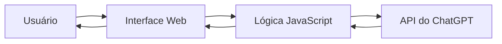

# 💬 Chat com API do ChatGPT  
### Trabalho da disciplina de Sistemas Distribuídos — Faculdade Nova Roma


Este repositório apresenta um projeto acadêmico desenvolvido para a cadeira de **Sistemas Distribuídos**, com foco na construção de uma aplicação web de **chat integrada à API do ChatGPT**.

---

## 📌 Sobre o projeto

O objetivo principal foi aplicar, na prática, conceitos da disciplina por meio da comunicação entre uma interface web e um serviço externo de IA.

### Conceitos trabalhados

- comunicação cliente-servidor;
- consumo de API REST;
- envio e recebimento de mensagens;
- organização da aplicação em camadas (interface + integração);
- tratamento básico de fluxo assíncrono.

---

## 🧠 Funcionalidades

- Interface de chat no navegador;
- Campo para envio de mensagens do usuário;
- Renderização das respostas da IA;
- Comunicação com serviço externo para geração de respostas.

---

## 🛠️ Tecnologias utilizadas

Com base na composição do repositório:

- **HTML** — 63.3%
- **JavaScript** — 25.8%
- **CSS** — 10.9%

---

## 🏗️ Arquitetura (visão geral)



Fluxo resumido:

1. Usuário envia uma mensagem pela interface;
2. JavaScript processa e dispara a requisição;
3. A aplicação consulta a API do ChatGPT;
4. A resposta retorna e é exibida no chat.

---

## 🚀 Como executar

> Como o projeto é majoritariamente front-end, estes passos cobrem o fluxo mais comum.

### 1) Clonar o repositório

```bash
git clone https://github.com/erick-henrick/Trabalho-Sistemas-Distribuidos.git
cd Trabalho-Sistemas-Distribuidos
```

### 2) Configurar chave da API (quando aplicável)

Se o projeto estiver configurado para usar variável de ambiente, defina:

```env
OPENAI_API_KEY=sua_chave_aqui
```

> **Importante:** nunca commitar chaves reais no repositório.

### 3) Executar localmente

Você pode abrir com um servidor local (recomendado), por exemplo:

```bash
npx serve .
```

Ou usar a extensão **Live Server** no VS Code.

---

## 📂 Estrutura do projeto

A estrutura pode variar conforme evolução do trabalho, mas normalmente inclui arquivos como:

```bash
.
├── index.html
├── style.css
├── script.js
├── assets/
└── README.md
```

---

## 📚 Aprendizados

Este trabalho permitiu vivenciar desafios comuns em sistemas distribuídos, como:

- dependência de serviços externos;
- latência de rede e tempo de resposta;
- tratamento de erros de comunicação;
- integração entre front-end e APIs.

---

## 🧪 Melhorias futuras

- [ ] Histórico persistente de conversas;
- [ ] Melhor tratamento de erros (timeout/rate limit);
- [ ] Indicador de carregamento (“IA digitando...”);
- [ ] Melhorias de responsividade e acessibilidade;
- [ ] Deploy público da aplicação.

---

## 👨‍💻 Autor

**Erick Henrick**  
Projeto da disciplina de **Sistemas Distribuídos** — Faculdade Nova Roma.

---

## 📄 Licença

Projeto com finalidade acadêmica/educacional.
